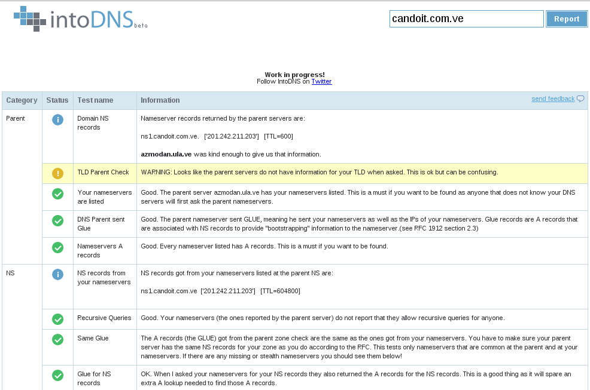
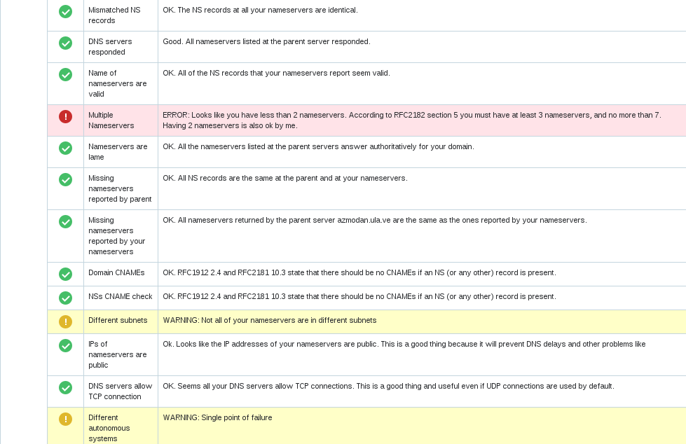
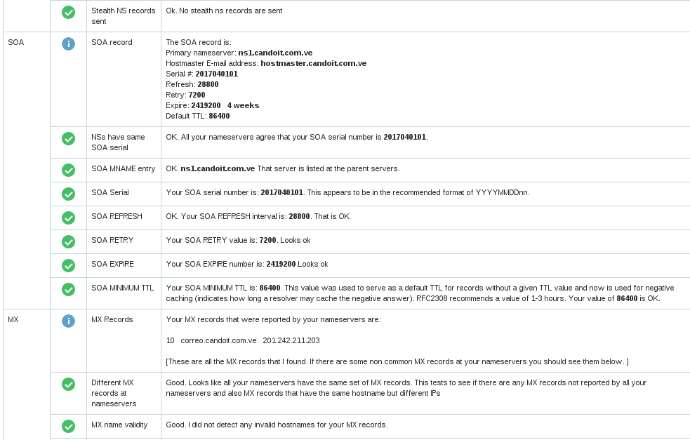
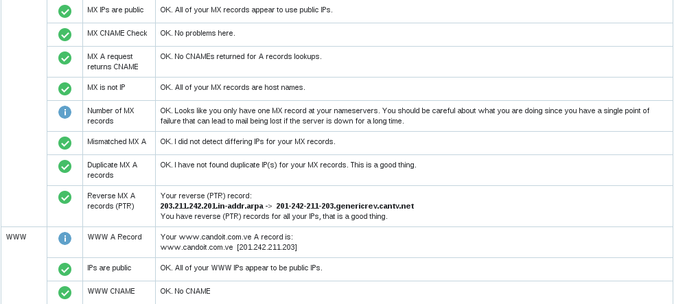

DNS Publico con CentOS GNU/Linux
========================

Configurar un DNS publico o mejor conocido como autoritativo. servidores DNS autoritativos son los servidores que dan respuestas a los servidores DNS recursivos. La respuesta que dan es la información de DNS esencial para cada sitio web (direcciones IP correspondientes, una lista de servidores de correo y otros registros DNS necesarios). En resumen, los servidores DNS autoritativos son los servidores que dan a los servidores DNS recursivos las respuestas correctas.

En este laboratorio debe tener un dominio preferiblemente obtenido en la NIC (`solo queremos el dominio, no un web hosting <https://github.com/cgomeznt/Configurar-Dominio-NIC>`_), en la NIC vamos a indicarle cual es el servidor(es) DNS autoritativos (nuestro servidor) para que este informado el TLD (Top level Domain). Nuestro servidor DNS autoritativo estara escuchando las peticiones TCP (transferencias de zonas) y UDP (consulta de registros) por el puerto 53, `el router gama hogar lo configuramos <https://github.com/cgomeznt/router-linksys>`_

Como estará configurado el laboratorio
+++++++++++++++++++++++++++++++++++++++

- Un dominio adquirido en la `NIC <https://github.com/cgomeznt/Configurar-Dominio-NIC>`_
- Un router `LINKSYS <https://github.com/cgomeznt/router-linksys>`_ , puede ser cualquiera...!!
- 192.168.1.20 -- CentOS 7, dns-01 -- bind9
- 192.168.1.21 -- CentOS 7, dns-02 -- bind9

Configuración del servidor DNS autoritativo
++++++++++++++++++++++++++++++++++++++++++++++

Instalamos los paquetes.::
	
	# yum -y install bind bind-utils

Más información, consulte la documentación /usr/share/doc/bind9/ , el man de named.conf (5) named (8).

Permisos en el firewalld, perminitos el TCP tambien porque asì lo requiere para transferencia de Zonas.::

	firewall-cmd --permanent --zone=public --add-port=53/tcp
	firewall-cmd --permanent --zone=public --add-port=53/udp
	firewall-cmd --reload

Empezamos con el archivo principal.::

	# vi named.conf
		...
		listen-on port 53 { any; };
		listen-on-v6 port 53 { any; };
		...

		...
		allow-query     { any; };
		allow-transfer  { none; };
		recursion no;
		...
		include "/etc/named/named.conf.public"
		
Todo el archivo named.conf queda de esta forma.::

	//
	// named.conf
	//
	// Provided by Red Hat bind package to configure the ISC BIND named(8) DNS
	// server as a caching only nameserver (as a localhost DNS resolver only).
	//
	// See /usr/share/doc/bind*/sample/ for example named configuration files.
	//
	// See the BIND Administrator's Reference Manual (ARM) for details about the
	// configuration located in /usr/share/doc/bind-{version}/Bv9ARM.html

	options {
			listen-on port 53 { 127.0.0.1;192.168.1.20; };
	# listen-on-v6 port 53 { ::1; };
			directory       "/var/named";
			dump-file       "/var/named/data/cache_dump.db";
			statistics-file "/var/named/data/named_stats.txt";
			memstatistics-file "/var/named/data/named_mem_stats.txt";
			recursing-file  "/var/named/data/named.recursing";
			secroots-file   "/var/named/data/named.secroots";
			allow-query     { any; };
			allow-transfer  { none; };

			/*
			 - If you are building an AUTHORITATIVE DNS server, do NOT enable recursion.
			 - If you are building a RECURSIVE (caching) DNS server, you need to enable
			   recursion.
			 - If your recursive DNS server has a public IP address, you MUST enable access
			   control to limit queries to your legitimate users. Failing to do so will
			   cause your server to become part of large scale DNS amplification
			   attacks. Implementing BCP38 within your network would greatly
			   reduce such attack surface
			*/
			recursion no;

			dnssec-enable yes;
			dnssec-validation yes;

			/* Path to ISC DLV key */
			bindkeys-file "/etc/named.root.key";

			managed-keys-directory "/var/named/dynamic";

			pid-file "/run/named/named.pid";
			session-keyfile "/run/named/session.key";
	};

	logging {
			channel default_debug {
					file "data/named.run";
					severity dynamic;
			};
	};

	zone "." IN {
			type hint;
			file "named.ca";
	};

	include "/etc/named.rfc1912.zones";
	include "/etc/named.root.key";
	#include "/etc/named/named.conf.local";
	include "/etc/named/named.conf.public";

Creamos el archivo "/etc/named/named.conf.public" donde estarán las zonas publicas, es decir, el archivo de configuración que indicara cuales son los archivos de zona para los dominios adquiridos en la NIC.::

	# vi /etc/named/named.conf.public
		zone "cursoinfraestructura.com.ve" IN {
			type master;
			file "cursoinfraestructura.com.ve";
		};

Verificamos el archivo de configuración, si esta bien no muestra nada, solo si existen errores.::

	# named-checkconf named.conf.public 
	# 

Creamos el archivo que tiene la configuración de la zona publicado en la NIC.::

	# vi /var/named/cursoinfraestructura.com.ve
		
		$TTL 3H
		@   IN SOA  @ hostmaster.cursoinfraestructura.com.ve. (
						1   ; serial   2017040101
						3H  ; refresh  8H
						1H  ; retry    2H
						1W  ; expire   4W
						3H )    ; minimum   1D
		@            IN   NS     ns1.cursoinfraestructura.com.ve.
		@            IN   MX     10 mail1.cursoinfraestructura.com.ve.
		@            IN   A      190.36.229.66	;Esta es la IP que esta registrada en la NIC
		ns1          IN   A      190.36.229.66	;Esta es la IP que esta registrada en la NIC
		mail1        IN   A      190.36.229.66	;Esta es la IP que esta registrada en la NIC
		myboss       IN   A      190.36.229.66	;Esta es la IP que esta registrada en la NIC
		@            IN   TXT    "v=spf1 a:mail1.cursoinfraestructura.com.ve ip4:190.36.229.66/23 -all"
		www          IN   CNAME  cursoinfraestructura.com.ve.
		mail         IN   CNAME  mail1.cursoinfraestructura.com.ve.

Verificamos el archivo de zona publicado en la NIC.::

	# named-checkzone cursoinfraestructura.com.ve /var/named/cursoinfraestructura.com.ve
	zone candoit.com.ve/IN: loaded serial 1
	OK

Reiniciamos el servicio de bind9.::

	# systemctl restart named
	# systemctl enabled named

Aqui ya podemos ir haciendo pruebas.::

	$ dig cursoinfraestructura.com.ve ANY
	;; Connection to 192.168.1.1#53(192.168.1.1) for cursoinfraestructura.com.ve failed: connection refused.

	; <<>> DiG 9.11.4-P2-RedHat-9.11.4-9.P2.el7 <<>> cursoinfraestructura.com.ve ANY
	;; global options: +cmd
	;; Got answer:
	;; ->>HEADER<<- opcode: QUERY, status: NOERROR, id: 27104
	;; flags: qr aa rd; QUERY: 1, ANSWER: 4, AUTHORITY: 0, ADDITIONAL: 3
	;; WARNING: recursion requested but not available

	;; OPT PSEUDOSECTION:
	; EDNS: version: 0, flags:; udp: 4096
	;; QUESTION SECTION:
	;cursoinfraestructura.com.ve.   IN      ANY

	;; ANSWER SECTION:
	cursoinfraestructura.com.ve. 10800 IN   SOA     cursoinfraestructura.com.ve. hostmaster.cursoinfraestructura.com.ve. 1 10800 3600 604800 10800
	cursoinfraestructura.com.ve. 10800 IN   NS      ns1.cursoinfraestructura.com.ve.
	cursoinfraestructura.com.ve. 10800 IN   MX      10 mail1.cursoinfraestructura.com.ve.
	cursoinfraestructura.com.ve. 10800 IN   A       190.36.229.66

	;; ADDITIONAL SECTION:
	ns1.cursoinfraestructura.com.ve. 10800 IN A     190.36.229.66
	mail1.cursoinfraestructura.com.ve. 10800 IN A   190.36.229.66

	;; Query time: 3 msec
	;; SERVER: 192.168.1.20#53(192.168.1.20)
	;; WHEN: Sat Apr 18 16:00:23 -04 2020
	;; MSG SIZE  rcvd: 191

También es bueno probar con esta herramienta que le ayuda a entonar los valores de su DNS http://www.intodns.com/ , si lo corren tal cual como esta esta configuración podrán ver que los warning se trata por convención que debe existir otro DNS autoritativo.

NOTA: las imagenes son de una consulta de mi dominio candoit, porque me dio flojera tomar las imagenes actuales de cursoinfraestructura.com.ve

NOTA: la zona inversa de su IP usted no pude controlarla, su ISP tiene que crearla. (Esto es muy importante si va tener correo con este su dominio por esta IP)
 
Hasta aquí tenemos un DNS autoritativo funcional...!!!

Ahora vamos a crear otro servidor DNS autoritativo pero que sea esclavo de nuestro primer DNS autoritativo. De ahora en adelante llamaremos Master al primer DNS autoritativo instalado y al siguiente Esclavo.

Lo primero que vamos hacer es ir a la NIC y al dominio adquirido agregar otro servidor DNS.  `NIC <https://github.com/cgomeznt/Configurar-Dominio-NIC>`_ 

En el servidor DNS Esclavo
==============================

Cambiar el nombre del servidor.::

	# vi /etc/hostname
	 dns-02

Instalamos los paquetes.::
	
	# yum -y install bind bind-utils

Más información, consulte la documentación /usr/share/doc/bind9/ , el man de named.conf (5) named (8).

Empezamos con el archivo principal. Este debe quedar igual que el servidor master::

	# vi named.conf
		...
		listen-on port 53 { any; };
		listen-on-v6 port 53 { any; };
		...

		...
		allow-query     { any; };
		allow-transfer  { none; };
		recursion no;
		...
		include "/etc/named/named.conf.public"

Creamos el archivo "/etc/named/named.conf.public" donde estarán las zonas publicas, es decir, el archivo de configuración que indicara cuales son los archivos de zona para los dominios adquiridos en la NIC.::

	# vi /etc/named/named.conf.public
		masters master {
		   192.168.1.10;
		};
		zone "cursoinfraestructura.com.ve" IN {
			type slave;
			file "cursoinfraestructura.com.ve";
			masters { master; };
		};

Verificamos el archivo de configuración, si esta bien no muestra nada, solo si existen errores.::

	# named-checkconf /etc/named/named.conf.public
	#

Reiniciamos el servicio de bind9.::

	# systemctl restart named
	# systemctl enabled named
	

Activar los LOGS
Tipee el siguiente comando como root para activar los log y observar los query DNS.:

	# rndc querylog

	Visualizar los LOGS
Para visualizar los log de los query en /var/log/messages tipee.:

	# tail -f /var/log/messages &
	
Podemos realizar las pruebas.::

	$ dig @192.168.1.20 cursoinfraestructura.com.ve ANY
	;; Connection to 192.168.1.1#53(192.168.1.1) for cursoinfraestructura.com.ve failed: connection refused.

	; <<>> DiG 9.11.4-P2-RedHat-9.11.4-9.P2.el7 <<>> cursoinfraestructura.com.ve ANY
	;; global options: +cmd
	;; Got answer:
	;; ->>HEADER<<- opcode: QUERY, status: NOERROR, id: 27104
	;; flags: qr aa rd; QUERY: 1, ANSWER: 4, AUTHORITY: 0, ADDITIONAL: 3
	;; WARNING: recursion requested but not available

	;; OPT PSEUDOSECTION:
	; EDNS: version: 0, flags:; udp: 4096
	;; QUESTION SECTION:
	;cursoinfraestructura.com.ve.   IN      ANY

	;; ANSWER SECTION:
	cursoinfraestructura.com.ve. 10800 IN   SOA     cursoinfraestructura.com.ve. hostmaster.cursoinfraestructura.com.ve. 1 10800 3600 604800 10800
	cursoinfraestructura.com.ve. 10800 IN   NS      ns1.cursoinfraestructura.com.ve.
	cursoinfraestructura.com.ve. 10800 IN   MX      10 mail1.cursoinfraestructura.com.ve.
	cursoinfraestructura.com.ve. 10800 IN   A       190.36.229.66

	;; ADDITIONAL SECTION:
	ns1.cursoinfraestructura.com.ve. 10800 IN A     190.36.229.66
	mail1.cursoinfraestructura.com.ve. 10800 IN A   190.36.229.66

	;; Query time: 3 msec
	;; SERVER: 192.168.1.20#53(192.168.1.20)
	;; WHEN: Sat Apr 18 16:00:23 -04 2020
	;; MSG SIZE  rcvd: 191

	$ dig @192.168.1.21 cursoinfraestructura.com.ve ANY
	;; Connection to 192.168.1.1#53(192.168.1.1) for cursoinfraestructura.com.ve failed: connection refused.

	; <<>> DiG 9.11.4-P2-RedHat-9.11.4-9.P2.el7 <<>> cursoinfraestructura.com.ve ANY
	;; global options: +cmd
	;; Got answer:
	;; ->>HEADER<<- opcode: QUERY, status: NOERROR, id: 27104
	;; flags: qr aa rd; QUERY: 1, ANSWER: 4, AUTHORITY: 0, ADDITIONAL: 3
	;; WARNING: recursion requested but not available

	;; OPT PSEUDOSECTION:
	; EDNS: version: 0, flags:; udp: 4096
	;; QUESTION SECTION:
	;cursoinfraestructura.com.ve.   IN      ANY

	;; ANSWER SECTION:
	cursoinfraestructura.com.ve. 10800 IN   SOA     cursoinfraestructura.com.ve. hostmaster.cursoinfraestructura.com.ve. 1 10800 3600 604800 10800
	cursoinfraestructura.com.ve. 10800 IN   NS      ns1.cursoinfraestructura.com.ve.
	cursoinfraestructura.com.ve. 10800 IN   MX      10 mail1.cursoinfraestructura.com.ve.
	cursoinfraestructura.com.ve. 10800 IN   A       190.36.229.66

	;; ADDITIONAL SECTION:
	ns1.cursoinfraestructura.com.ve. 10800 IN A     190.36.229.66
	mail1.cursoinfraestructura.com.ve. 10800 IN A   190.36.229.66

	;; Query time: 3 msec
	;; SERVER: 192.168.1.20#53(192.168.1.20)
	;; WHEN: Sat Apr 18 16:00:23 -04 2020
	;; MSG SIZE  rcvd: 191

	$ dig @8.8.8.8 cursoinfraestructura.com.ve ANY
	;; Connection to 192.168.1.1#53(192.168.1.1) for cursoinfraestructura.com.ve failed: connection refused.

	; <<>> DiG 9.11.4-P2-RedHat-9.11.4-9.P2.el7 <<>> cursoinfraestructura.com.ve ANY
	;; global options: +cmd
	;; Got answer:
	;; ->>HEADER<<- opcode: QUERY, status: NOERROR, id: 27104
	;; flags: qr aa rd; QUERY: 1, ANSWER: 4, AUTHORITY: 0, ADDITIONAL: 3
	;; WARNING: recursion requested but not available

	;; OPT PSEUDOSECTION:
	; EDNS: version: 0, flags:; udp: 4096
	;; QUESTION SECTION:
	;cursoinfraestructura.com.ve.   IN      ANY

	;; ANSWER SECTION:
	cursoinfraestructura.com.ve. 10800 IN   SOA     cursoinfraestructura.com.ve. hostmaster.cursoinfraestructura.com.ve. 1 10800 3600 604800 10800
	cursoinfraestructura.com.ve. 10800 IN   NS      ns1.cursoinfraestructura.com.ve.
	cursoinfraestructura.com.ve. 10800 IN   MX      10 mail1.cursoinfraestructura.com.ve.
	cursoinfraestructura.com.ve. 10800 IN   A       190.36.229.66

	;; ADDITIONAL SECTION:
	ns1.cursoinfraestructura.com.ve. 10800 IN A     190.36.229.66
	mail1.cursoinfraestructura.com.ve. 10800 IN A   190.36.229.66

	;; Query time: 3 msec
	;; SERVER: 192.168.1.20#53(192.168.1.20)
	;; WHEN: Sat Apr 18 16:00:23 -04 2020
	;; MSG SIZE  rcvd: 191

