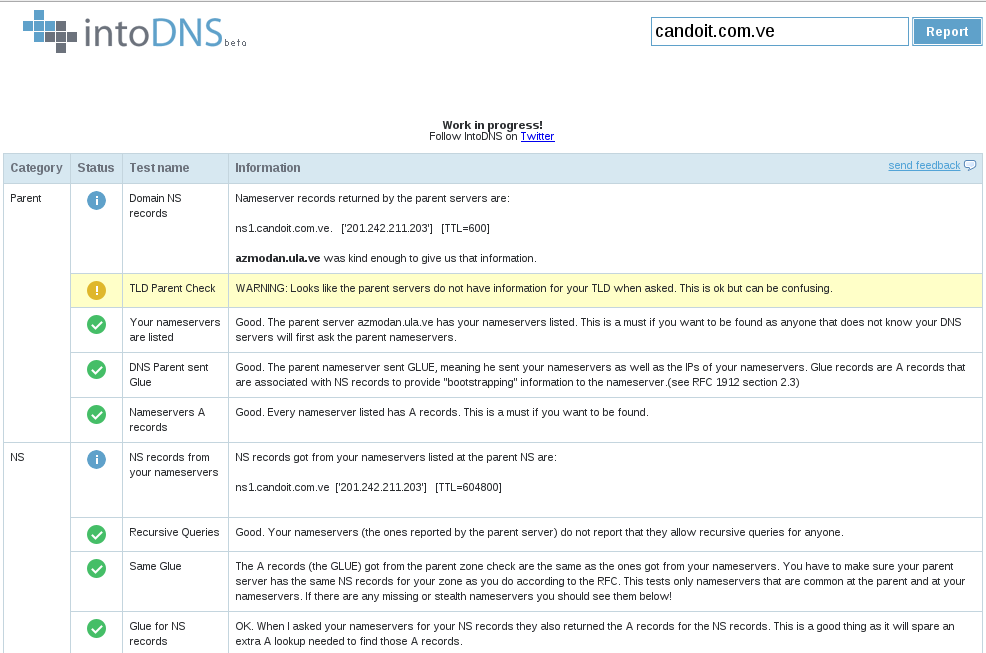
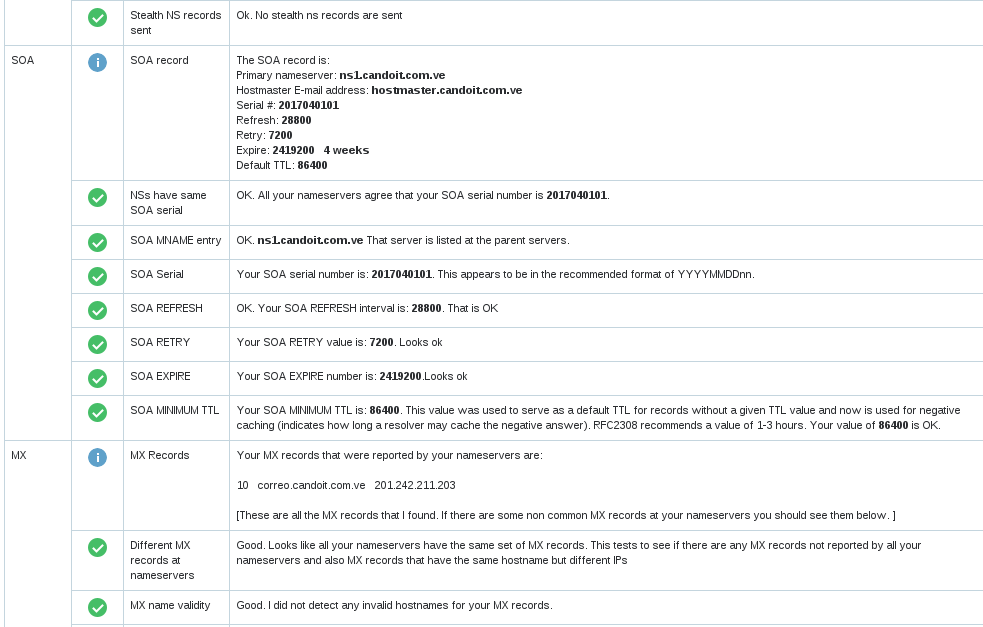

DNS Publico en GNU/Linux
========================

Configurar un DNS publico o mejor conocido como autoritativo. servidores DNS autoritativos son los servidores que dan respuestas a los servidores DNS recursivos. La respuesta que dan es la información de DNS esencial para cada sitio web (direcciones IP correspondientes, una lista de servidores de correo y otros registros DNS necesarios). En resumen, los servidores DNS autoritativos son los servidores que dan a los servidores DNS recursivos las respuestas correctas.

En este laboratorio debe tener un dominio preferiblemente obtenido en la NIC (`solo queremos el dominio, no un web hosting <https://github.com/cgomeznt/Configurar-Dominio-NIC>`_), en la NIC vamos a indicarle cual es el servidor(es) DNS autoritativos (nuestro servidor) para que este informado el TLD (Top level Domain). Nuestro servidor DNS autoritativo estara escuchando las peticiones TCP (transferencias de zonas) y UDP (consulta de registros) por el puerto 53, `el router gama hogar lo configuramos <https://github.com/cgomeznt/router-linksys>`_

Como estará configurado el laboratorio
+++++++++++++++++++++++++++++++++++++++

- Un dominio adquirido en la `NIC <https://github.com/cgomeznt/Configurar-Dominio-NIC>`_
- Un router `LINKSYS <https://github.com/cgomeznt/router-linksys>`_ , puede ser cualquiera...!!
- 192.168.1.10 -- Ubuntu 14.04.4, dns-01 -- bind9
- 192.168.1.20 -- Ubuntu 14.04.4, dns-02 -- bind9

Configuración del servidor DNS autoritativo
++++++++++++++++++++++++++++++++++++++++++++++

Configuremos la interfaz de red, (Importante que este como adaptador puente)::

	# vi /etc/network/interfaces
	# The loopback network interface
	auto lo
	iface lo inet loopback

	# The primary network interface
	auto eth0
	iface eth0 inet static
	address 192.168.1.10
	netmask 255.255.255.0
	gateway 192.168.1.1
	dns-nameserver 192.168.1.1

Cambiar el nombre del servidor.::

	# vi /etc/hostname
	 dns-01

Instalamos los paquetes.::
	
	# apt-get update && apt-get install openssh-server bind9 bind9-doc -y

Más información, consulte la documentación /usr/share/doc/bind9/ , el man de named.conf (5) named (8).

Despues de instalar.::

	# ls -l
	total 52
	-rw-r--r-- 1 root root 2389 Mar  8 10:24 bind.keys
	-rw-r--r-- 1 root root  237 Mar  8 10:24 db.0
	-rw-r--r-- 1 root root  271 Mar  8 10:24 db.127
	-rw-r--r-- 1 root root  237 Mar  8 10:24 db.255
	-rw-r--r-- 1 root root  353 Mar  8 10:24 db.empty
	-rw-r--r-- 1 root root  270 Mar  8 10:24 db.local
	-rw-r--r-- 1 root root 3048 Mar  8 10:24 db.root
	-rw-r--r-- 1 root bind  463 Mar  8 10:24 named.conf
	-rw-r--r-- 1 root bind  490 Mar  8 10:24 named.conf.default-zones
	-rw-r--r-- 1 root bind  165 Mar  8 10:24 named.conf.local
	-rw-r--r-- 1 root bind  890 Apr 20 18:56 named.conf.options
	-rw-r----- 1 bind bind   77 Apr 20 18:56 rndc.key
	-rw-r--r-- 1 root root 1317 Mar  8 10:24 zones.rfc1918

Empezamos con el archivo principal.::

	# vi named.conf.local
	//
	// Do any local configuration here
	//

	// Consider adding the 1918 zones here, if they are not used in your
	// organization
	//include "/etc/bind/zones.rfc1918";

	root@dns-01:/etc/bind# cat named.conf
	// This is the primary configuration file for the BIND DNS server named.
	//
	// Please read /usr/share/doc/bind9/README.Debian.gz for information on the 
	// structure of BIND configuration files in Debian, *BEFORE* you customize 
	// this configuration file.
	//
	// If you are just adding zones, please do that in /etc/bind/named.conf.local

	include "/etc/bind/named.conf.options";
	// include "/etc/bind/named.conf.local";  Este es el original pero vamos a romper un poco las reglas, lo documentamos
	include "/etc/bind/dominios.externos"; //Este archivo lo vamos a crear y tendrá la configuración de los dominios publicados en Internet, los adquiridos en la NIC
	//include "/etc/bind/dominios.internos"; //Este archivo lo vamos a crear y tendrá la configuración de los dominios Internos.
	include "/etc/bind/named.conf.default-zones";

Creamos el archivo "/etc/bind/dominios.externos" donde estarán las zonas publicas, es decir, el archivo de configuración que indicara cuales son los archivos de zona para los dominios adquiridos en la NIC.

	# vi /etc/bind/dominios.externos
	//
	// Do any local configuration here
	//

	// Consider adding the 1918 zones here, if they are not used in your
	// organization
	//include "/etc/bind/zones.rfc1918";

	zone "candoit.com.ve" {
	   type master;
	   file "/etc/bind/candoit.com.ve";
	};

Verificamos el archivo de configuración, si esta bien no muestra nada, solo si existen errores.::

	# named-checkconf dominios.externos 
	# 

Creamos el archivo que tiene la configuración de la zona publicado en la NIC.::

	# vi candoit.com.ve
	$TTL    604800
	@       IN      SOA     ns1.candoit.com.ve.  hostmaster.candoit.com.ve. (
		                    2017040101      ; serial
		                    8H              ; refresh
		                    2H              ; retry
		                    4W              ; expire
		                    1D )            ; minimum

	;
	@       IN      NS      ns1
	@       IN      MX 10   correo
	;
	candoit.com.ve.  A       201.242.211.203	;Esta es la IP que esta registrada en la NIC
	ns1     A       201.242.211.203				;Esta es la IP que esta registrada en la NIC
	correo  A       201.242.211.203				;Esta es la IP que esta registrada en la NIC
	www     A       201.242.211.203				;Esta es la IP que esta registrada en la NIC

Verificamos el archivo de zona publicado en la NIC.::

	# named-checkzone candoit.com.ve /etc/bind/candoit.com.ve 
	zone candoit.com.ve/IN: loaded serial 2017040101
	OK

Reiniciamos el servicio de bind9.::

	# /etc/init.d/bind9 restart
	  Stopping domain name service... bind9                                                                                     		rndc: connect failed: 127.0.0.1#953: connection refused			[ OK ]
	  Starting domain name service... bind9								[ OK ]

Aqui ya podemos ir haciendo pruebas.::

	$ dig candoit.com.ve ANY

	; <<>> DiG 9.9.5-9-Debian <<>> candoit.com.ve ANY
	;; global options: +cmd
	;; Got answer:
	;; ->>HEADER<<- opcode: QUERY, status: NOERROR, id: 64333
	;; flags: qr rd ra; QUERY: 1, ANSWER: 4, AUTHORITY: 0, ADDITIONAL: 1

	;; OPT PSEUDOSECTION:
	; EDNS: version: 0, flags:; udp: 4096
	;; QUESTION SECTION:
	;candoit.com.ve.			IN	ANY

	;; ANSWER SECTION:
	candoit.com.ve.		3600	IN	A	201.242.211.203
	candoit.com.ve.		3600	IN	MX	10 correo.candoit.com.ve.
	candoit.com.ve.		3600	IN	SOA	ns1.candoit.com.ve. hostmaster.candoit.com.ve. 2017040101 28800 7200 2419200 86400
	candoit.com.ve.		600	IN	NS	ns1.candoit.com.ve.

	;; Query time: 216 msec
	;; SERVER: 200.44.32.12#53(200.44.32.12)
	;; WHEN: Wed Apr 20 19:57:39 VET 2016
	;; MSG SIZE  rcvd: 147

También es bueno probar con esta herramienta que le ayuda a entonar los valores de su DNS http://www.intodns.com/ , si lo corren tal cual como esta esta configuración podrán ver que los warning se trata por convención que debe existir otro DNS autoritativo.

.. figure:: ../images/intodns-2.png

.. figure:: ../images/intodns-4.png

NOTA: la zona inversa de su IP usted no pude controlarla, su ISP tiene que crearla. (Esto es muy importante si va tener correo con este su dominio por esta IP)
 
Hasta aquí tenemos un DNS autoritativo funcional...!!!

Ahora vamos a crear otro servidor DNS autoritativo pero que sea esclavo de nuestro primer DNS autoritativo. De ahora en adelante llamaremos Master al primer DNS autoritativo instalado y al siguiente Esclavo.

Lo primero que vamos hacer es ir a la NIC y al dominio adquirido agregar otro servidor DNS.  `NIC <https://github.com/cgomeznt/Configurar-Dominio-NIC>`_ 

En el servidor DNS Esclavo
Configuremos la interfaz de red, (Importante que este como adaptador puente)::

	# vi /etc/network/interfaces
	# The loopback network interface
	auto lo
	iface lo inet loopback

	# The primary network interface
	auto eth0
	iface eth0 inet static
	address 192.168.1.20
	netmask 255.255.255.0
	gateway 192.168.1.1
	dns-nameserver 192.168.1.1

Cambiar el nombre del servidor.::

	# vi /etc/hostname
	 dns-02

Instalamos los paquetes.::
	
	# apt-get update && apt-get install openssh-server bind9 bind9-doc -y

Más información, consulte la documentación /usr/share/doc/bind9/ , el man de named.conf (5) named (8).

Despues de instalar.::

	# ls -l
	total 52
	-rw-r--r-- 1 root root 2389 Mar  8 10:24 bind.keys
	-rw-r--r-- 1 root root  237 Mar  8 10:24 db.0
	-rw-r--r-- 1 root root  271 Mar  8 10:24 db.127
	-rw-r--r-- 1 root root  237 Mar  8 10:24 db.255
	-rw-r--r-- 1 root root  353 Mar  8 10:24 db.empty
	-rw-r--r-- 1 root root  270 Mar  8 10:24 db.local
	-rw-r--r-- 1 root root 3048 Mar  8 10:24 db.root
	-rw-r--r-- 1 root bind  463 Mar  8 10:24 named.conf
	-rw-r--r-- 1 root bind  490 Mar  8 10:24 named.conf.default-zones
	-rw-r--r-- 1 root bind  165 Mar  8 10:24 named.conf.local
	-rw-r--r-- 1 root bind  890 Apr 20 18:56 named.conf.options
	-rw-r----- 1 bind bind   77 Apr 20 18:56 rndc.key
	-rw-r--r-- 1 root root 1317 Mar  8 10:24 zones.rfc1918

Ahora nos vamos al servidor Master y editamos el archivo "named.conf".::

	# vi /etc/bind/named.conf
	//
	// Do any local configuration here
	//

	// Consider adding the 1918 zones here, if they are not used in your
	// organization
	//include "/etc/bind/zones.rfc1918";

	root@dns-01:/etc/bind# cat named.conf
	// This is the primary configuration file for the BIND DNS server named.
	//
	// Please read /usr/share/doc/bind9/README.Debian.gz for information on the 
	// structure of BIND configuration files in Debian, *BEFORE* you customize 
	// this configuration file.
	//
	// If you are just adding zones, please do that in /etc/bind/named.conf.local

	include "/etc/bind/named.conf.options";
	// include "/etc/bind/named.conf.local";  Este es el original pero vamos a romper un poco las reglas, lo documentamos
	include "/etc/bind/dominios.externos"; //Este archivo lo vamos a crear y tendrá la configuración de los dominios publicados en Internet, los adquiridos en la NIC
	//include "/etc/bind/dominios.internos"; //Este archivo lo vamos a crear y tendrá la configuración de los dominios Internos.
	include "/etc/bind/named.conf.default-zones";

Creamos el archivo "candoit.com.ve".::

	# vi /etc/bind/candoit.com.ve
	$TTL    604800
	@       IN      SOA     ns1.candoit.com.ve.  hostmaster.candoit.com.ve. (
		                    2017040102      ; serial
		                    8H              ; refresh
		                    2H              ; retry
		                    4W              ; expire
		                    1D )            ; minimum

	;
	@       IN      NS      ns1
	@       IN      NS      ns2
	@       IN      MX 10   correo
	;
	candoit.com.ve.  A       201.242.211.203
	ns1     A       201.242.211.203
	ns2     A       201.242.211.203
	correo  A       201.242.211.203
	www     A       201.242.211.203

Ahora en el Esclavo realizamos las siguiente configuraciones.::

Creamos el archivo "/etc/bind/dominios.externos" donde estarán las zonas publicas, es decir, el archivo de configuración que indicara cuales son los archivos de zona para los dominios adquiridos en la NIC, pero con la caracteristica de Esclavo.

	# vi /etc/bind/dominios.externos
	//
	// Do any local configuration here
	//

	// Consider adding the 1918 zones here, if they are not used in your
	// organization
	//include "/etc/bind/zones.rfc1918";

	// Creamos una acl con los servidores que seran los esclavos
	masters master {
	   192.168.1.10;
	};

	zone "candoit.com.ve" {
	   type slave;
	   file "/var/lib/bind/candoit.com.ve";
	   masters { master; };
	};

Verificamos el archivo de configuración, si esta bien no muestra nada, solo si existen errores.::

	# named-checkconf dominios.externos 
	#

Reiniciamos el servicio de bind9.::

	# /etc/init.d/bind9 restart
	  Stopping domain name service... bind9                                                                                     		rndc: connect failed: 127.0.0.1#953: connection refused			[ OK ]
	  Starting domain name service... bind9								[ OK ]

Podemos realizar las pruebas.::

	$  dig @192.168.1.10 candoit.com.ve ANY

	; <<>> DiG 9.9.5-9-Debian <<>> @192.168.1.10 candoit.com.ve ANY
	; (1 server found)
	;; global options: +cmd
	;; Got answer:
	;; ->>HEADER<<- opcode: QUERY, status: NOERROR, id: 45842
	;; flags: qr aa rd ra; QUERY: 1, ANSWER: 5, AUTHORITY: 0, ADDITIONAL: 4

	;; OPT PSEUDOSECTION:
	; EDNS: version: 0, flags:; udp: 4096
	;; QUESTION SECTION:
	;candoit.com.ve.			IN	ANY

	;; ANSWER SECTION:
	candoit.com.ve.		604800	IN	SOA	ns1.candoit.com.ve. hostmaster.candoit.com.ve. 2017040102 28800 7200 2419200 86400
	candoit.com.ve.		604800	IN	NS	ns2.candoit.com.ve.
	candoit.com.ve.		604800	IN	NS	ns1.candoit.com.ve.
	candoit.com.ve.		604800	IN	MX	10 correo.candoit.com.ve.
	candoit.com.ve.		604800	IN	A	201.242.211.203

	;; ADDITIONAL SECTION:
	ns1.candoit.com.ve.	604800	IN	A	201.242.211.203
	ns2.candoit.com.ve.	604800	IN	A	201.242.211.203
	correo.candoit.com.ve.	604800	IN	A	201.242.211.203

	;; Query time: 1 msec
	;; SERVER: 192.168.1.10#53(192.168.1.10)
	;; WHEN: Wed Apr 20 21:22:24 VET 2016
	;; MSG SIZE  rcvd: 213

	$  dig @192.168.1.20 candoit.com.ve ANY

	; <<>> DiG 9.9.5-9-Debian <<>> @192.168.1.20 candoit.com.ve ANY
	; (1 server found)
	;; global options: +cmd
	;; Got answer:
	;; ->>HEADER<<- opcode: QUERY, status: NOERROR, id: 12126
	;; flags: qr aa rd ra; QUERY: 1, ANSWER: 5, AUTHORITY: 0, ADDITIONAL: 4

	;; OPT PSEUDOSECTION:
	; EDNS: version: 0, flags:; udp: 4096
	;; QUESTION SECTION:
	;candoit.com.ve.			IN	ANY

	;; ANSWER SECTION:
	candoit.com.ve.		604800	IN	SOA	ns1.candoit.com.ve. hostmaster.candoit.com.ve. 2017040102 28800 7200 2419200 86400
	candoit.com.ve.		604800	IN	A	201.242.211.203
	candoit.com.ve.		604800	IN	MX	10 correo.candoit.com.ve.
	candoit.com.ve.		604800	IN	NS	ns1.candoit.com.ve.
	candoit.com.ve.		604800	IN	NS	ns2.candoit.com.ve.

	;; ADDITIONAL SECTION:
	correo.candoit.com.ve.	604800	IN	A	201.242.211.203
	ns1.candoit.com.ve.	604800	IN	A	201.242.211.203
	ns2.candoit.com.ve.	604800	IN	A	201.242.211.203

	;; Query time: 0 msec
	;; SERVER: 192.168.1.20#53(192.168.1.20)
	;; WHEN: Wed Apr 20 21:22:56 VET 2016
	;; MSG SIZE  rcvd: 213

