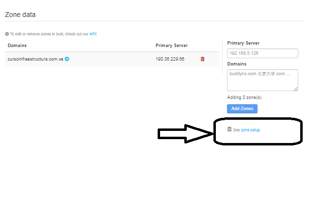

Seconday DNS public Free
=========================

Servidor secundario o esclavo: cuando la información de un servidor de nombres no procede de los archivos de zona propios, sino que son de segunda o de tercera mano, este servidor se convierte en secundario o esclavo para esta información. Esta situación se produce cuando un servidor no puede resolver una petición con su propia base de datos y ha de recurrir a la información disponible en otro servidor de nombres (resolución recursiva). Estos datos del DNS se guardan de forma temporal en un almacenamiento local (caching) y se proporcionan en caso de peticiones futuras. Como es posible que las entradas en el propio archivo de zona hayan cambiado en el ínterin, la información proporcionada por servidores secundarios no se considera segura
En este caso vamos a utilizar un servicio de buddns free para lograr esta actividad. 

Vamos a la pagina de buddns https://www.buddyns.com/ 

Procedemos a registrarnos y en el momento del registro ya nos pide el nombre del dominio y la direccion IP en donde esta el DNS de dicho dominio.

Entramos al main dashboard y ya vemos los datos de nuestro dominio.

Pero para que esto funcione debemos realizar unas modificaciones en nuestro DNS publico.

Aqui esta toda la domumentacion que necesitamos para que todo funcione.

Lo primero que debemos hacer, ir a nuestro DNS Publico y en el archivo *named.conf" debemos agregar las lineas como ellos nos indican del *allow-transfe*, esto es para permitir la transferencia de Zona, recuerda que debes tener habilidado el puerto 53 TCP.

Ahora nos vamos a esta secciòn.

Aqui nos daran todo el detalle del resto de la configuraciòn.
 

 
 1.- Se debe seleccional almenos tres (3) servidores DNS, ellos nos colocan los nombres largos por seguridad, pero en la Nic no nos permite ingresar tantos caracteres, por lo tanto debemos hacer que muestre los nombres cortos
 Al tener los nombres cortos los copiamos y los agregamos en nuestro servidor DNS Publico en el archivo de Zona.::
 
	 zone "cursoinfraestructura.com.ve" {
	 IN NS d.pro.ns.buddyns.com.
	 IN NS i.pro.ns.buddyns.com.
	 IN NS h.pro.ns.buddyns.com.
	}
 
Uno de estos Nombres tambien debemos agregarlo en la NIC.ve como servidor DNS Autoritativo. Esto con el fin que la NIC este enterado que este es nuestro DNS Secundario.
 

Ya con las configuraciones realizados nos podemos ir al BuddyBoard y realizar el test.
 

 
 
Listo ya con esto nuestra Zona fue transferida y buddns es nuestro DNS Secundary

 
Y cuando realicen la consulta por nuestro dominio este sera el TRACE.
 

 